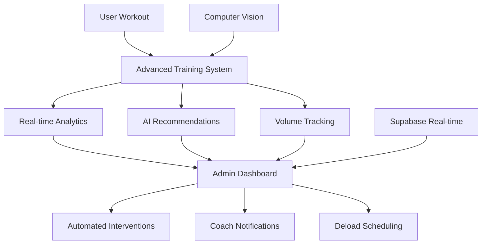

# AI-Powered Fitness Administration System

## Overview

This comprehensive AI-powered fitness application administration system provides intelligent automation, predictive analytics, and advanced user management capabilities. The system is designed to scale with your fitness platform while maintaining the highest standards of user privacy and data security.

## Core Architecture

### 1. Progressive AI Learning System (`lib/admin/ai-core-system.ts`)

The heart of the administration system, featuring:

- **Rule-based Logic**: Initial recommendations based on predefined rules
- **Machine Learning Evolution**: Gradual transition to ML models based on user behavior
- **Intelligent User Segmentation**: Automatic categorization based on activity patterns
- **Predictive Analytics**: Churn risk prediction and user behavior forecasting

#### Key Features:
- User segmentation (High Performers, Steady Progressors, At Risk)
- Rule-based recommendation engine
- Predictive analytics for user retention
- Real-time behavior analysis

### 2. User Management Module (`app/admin/users/page.tsx`)

Advanced user management with AI insights:

- **User Profiles**: Comprehensive user data with fitness assessments
- **AI-Enhanced Analytics**: Engagement scores, churn risk, completion rates
- **Segmentation**: Automatic user categorization with behavioral insights
- **Bulk Operations**: Import, export, and mass communication tools

#### Features:
- Real-time user statistics
- AI-powered user segmentation
- Advanced filtering and search
- Export capabilities for external analysis

### 3. Analytics & Reporting Module (`app/admin/analytics/page.tsx`)

Real-time dashboards and predictive analytics:

- **Live Metrics**: Real-time user activity and system performance
- **Engagement Analysis**: Session duration, bounce rates, return users
- **Retention Tracking**: Day 1, 7, 30, and 90-day retention rates
- **AI Performance**: Model accuracy and prediction confidence

#### Dashboards:
- Overview with key metrics
- Engagement analysis
- Retention cohort analysis
- Predictive AI insights
- AI model performance tracking

### 4. AI Engine Management (`app/admin/ai/page.tsx`)

Comprehensive AI system control:

- **Model Management**: Activate/deactivate AI models
- **Performance Monitoring**: Accuracy, confidence, and training metrics
- **Recommendation Engine**: View and manage AI-generated recommendations
- **Computer Vision**: Form analysis and posture correction (in development)

#### AI Models:
- Recommendation Engine v2.0
- User Segmentation Model
- Churn Prediction Model v3.0
- Computer Vision Form Checker

### 5. Communication & Notifications (`app/admin/communications/page.tsx`)

AI-optimized messaging system:

- **Campaign Management**: Create, schedule, and manage communication campaigns
- **AI Optimization**: Automatic message optimization for better engagement
- **Automation Rules**: Trigger-based automated communications
- **Multi-channel**: Email, push notifications, SMS, and in-app messages

#### Features:
- Campaign performance tracking
- A/B testing capabilities
- Automated engagement triggers
- Personalized messaging based on user segments

### 6. Business Intelligence & Reports (`app/admin/reports/page.tsx`)

Advanced reporting and KPI tracking:

- **KPI Dashboard**: Real-time business metrics with trend analysis
- **Report Templates**: Pre-built reports for different stakeholders
- **Custom Reports**: Drag-and-drop report builder
- **Automated Distribution**: Scheduled report generation and delivery

#### Report Types:
- User Engagement Reports
- AI Performance Dashboards
- Business Intelligence Summaries
- Custom Analytics Reports

### 7. Computer Vision System (`lib/admin/computer-vision-system.ts`)

Real-time exercise form analysis:

- **Pose Detection**: Real-time body pose estimation
- **Form Analysis**: Exercise-specific form correction
- **Rep Counting**: Automatic repetition tracking
- **Feedback System**: Real-time form feedback and corrections

#### Supported Exercises:
- Squats with depth and knee alignment analysis
- Push-ups with plank position monitoring
- Deadlifts with spine neutrality checking
- Extensible framework for additional exercises

## Implementation Strategy

### Phase 1: Core Infrastructure (Weeks 1-4)
1. Set up AI core system with rule-based recommendations
2. Implement user management with basic segmentation
3. Create analytics dashboard with real-time metrics
4. Deploy basic communication system

### Phase 2: AI Enhancement (Weeks 5-8)
1. Implement predictive analytics for churn prevention
2. Add AI-powered user segmentation
3. Deploy recommendation engine optimization
4. Create automated communication triggers

### Phase 3: Advanced Features (Weeks 9-12)
1. Implement computer vision system
2. Add advanced business intelligence reports
3. Deploy A/B testing for communications
4. Create custom report builder

### Phase 4: Optimization & Scaling (Weeks 13-16)
1. Optimize AI model performance
2. Implement advanced security features
3. Add integration capabilities
4. Deploy advanced automation rules

## Security & Privacy

### Data Protection
- End-to-end encryption for sensitive health data
- HIPAA and GDPR compliance implementation
- Regular security audits and penetration testing
- User consent management with granular controls

### Access Control
- Multi-tier permission system (Super Admin, Coach, Nutritionist, User)
- Granular access controls for different data types
- Audit trails for all administrative actions
- Role-based feature access

### Privacy Framework
- Data anonymization for analytics and AI training
- User data retention policies
- Right to be forgotten implementation
- Transparent data usage policies

## Technical Requirements

### Backend Infrastructure
- Node.js with TypeScript
- Supabase for database and real-time features
- Edge Functions for AI processing
- CDN for multimedia content delivery

### AI/ML Stack
- TensorFlow.js for client-side AI
- MediaPipe for computer vision
- Custom recommendation algorithms
- Real-time prediction engines

### Frontend Technologies
- Next.js 13+ with App Router
- React with TypeScript
- Tailwind CSS for styling
- Framer Motion for animations

### Integration Capabilities
- Wearable device APIs (Fitbit, Apple Health, Google Fit, WHOOP)
- Third-party fitness app integrations
- Nutrition database APIs
- Calendar and scheduling systems

## Monitoring & Maintenance

### System Health
- Real-time system performance monitoring
- AI model accuracy tracking
- User engagement metrics
- Error tracking and alerting

### Maintenance Tasks
- Regular AI model retraining
- Database optimization
- Security updates
- Performance optimization

### Scaling Considerations
- Microservices architecture for independent scaling
- Cloud-native deployment with auto-scaling
- API-first design for future integrations
- Database optimization for large-scale user data

## Getting Started

### Prerequisites
- Node.js 18+
- Supabase account
- TypeScript knowledge
- React/Next.js experience

### Installation
1. Clone the repository
2. Install dependencies: `npm install`
3. Set up environment variables
4. Configure Supabase connection
5. Run development server: `npm run dev`

### Configuration
1. Set up Supabase tables and RLS policies
2. Configure AI model parameters
3. Set up communication channels
4. Configure security settings

## API Documentation

### AI Core System
```typescript
// Generate recommendations for a user
const recommendations = await aiSystem.generateRuleBasedRecommendations(userId)

// Segment all users
const segments = await aiSystem.segmentUsers()

// Get predictive analytics
const analytics = await aiSystem.generatePredictiveAnalytics(userId)
```

### Computer Vision
```typescript
// Initialize computer vision system
await computerVisionSystem.initialize()

// Set exercise type
computerVisionSystem.setExerciseType('squat')

// Analyze pose from video frame
const pose = await computerVisionSystem.detectPose(imageData)
const analysis = computerVisionSystem.analyzeExerciseForm(pose)
```

## Enhanced Training Module Integration

### Real-time Training Execution (`app/training/execute-workout/[dayId]/page.tsx`)

The enhanced workout execution system provides:

- **Real-time Progress Tracking**: Live monitoring of sets, reps, weight, and RPE
- **AI-Powered Recommendations**: Dynamic exercise suggestions based on performance
- **Computer Vision Integration**: Real-time form analysis and correction
- **Volume Landmarks Tracking**: MEV, MAV, MRV monitoring for advanced users
- **Automated Deload Detection**: AI-driven fatigue analysis and recovery recommendations

#### Key Features:
```typescript
// Start workout session with real-time tracking
const session = await advancedTrainingSystem.startWorkoutSession(userId, routineId)

// Update progress with detailed metrics
await advancedTrainingSystem.updateSessionProgress(sessionId, exerciseId, setData)

// Complete workout with comprehensive analytics
await advancedTrainingSystem.completeWorkoutSession(sessionId, rpe, notes)
```

### Advanced Training System (`lib/training/advanced-training-system.ts`)

Core system providing:

- **Periodization Management**: Macrocycle, mesocycle, and microcycle planning
- **Volume Landmarks Calculation**: Automatic MEV/MAV/MRV determination
- **AI Exercise Recommendations**: Machine learning-based suggestions
- **Deload Automation**: Intelligent recovery week implementation
- **Real-time Metrics**: Comprehensive training analytics

#### Volume Landmarks Implementation:
```typescript
// Calculate personalized volume landmarks
const landmarks = await advancedTrainingSystem.calculateVolumeLandmarks(userId, muscleGroup)

// Check if deload is needed
const needsDeload = await advancedTrainingSystem.checkDeloadRequirement(userId)

// Implement automated deload
if (needsDeload) {
  await advancedTrainingSystem.implementDeload(userId)
}
```

### Admin Training Analytics (`app/admin/training-analytics/page.tsx`)

Comprehensive admin oversight featuring:

- **Real-time Monitoring**: Live workout tracking and user progress
- **AI Insights Dashboard**: Machine learning recommendations and interventions
- **Volume Analysis**: Population-level volume landmark statistics
- **User Segmentation**: Automatic categorization based on performance
- **Predictive Analytics**: Churn risk and performance forecasting

#### Real-time Monitoring Features:
- Active workout tracking with live updates
- Form analysis alerts and interventions
- Fatigue monitoring and deload recommendations
- Automated coaching notifications

### Computer Vision Integration (`lib/admin/computer-vision-system.ts`)

AI-powered form analysis providing:

- **Real-time Pose Detection**: MediaPipe-based body tracking
- **Exercise-specific Analysis**: Customized form checking for different movements
- **Feedback Generation**: Instant corrections and technique improvements
- **Progress Tracking**: Form score evolution over time

#### Supported Exercises:
- Squats: Depth, knee alignment, spine position
- Push-ups: Plank maintenance, elbow tracking, range of motion
- Deadlifts: Spine neutrality, bar path, hip hinge mechanics

### Data Flow Architecture



### Integration Benefits

1. **Seamless Data Flow**: Training execution automatically feeds admin analytics
2. **Proactive Interventions**: AI-driven alerts prevent overtraining and injuries
3. **Personalized Optimization**: Volume landmarks ensure optimal training loads
4. **Real-time Coaching**: Instant feedback and form corrections
5. **Predictive Analytics**: Early identification of at-risk users

### Technical Implementation

#### Supabase Integration:
- Real-time subscriptions for live workout monitoring
- Comprehensive data storage for training metrics
- Row-level security for user data protection

#### AI/ML Pipeline:
- Progressive learning from rule-based to machine learning
- User segmentation based on training patterns
- Predictive modeling for performance optimization

#### Computer Vision:
- Client-side pose detection for privacy
- Real-time feedback without server dependency
- Extensible framework for new exercise types

## Support & Documentation

For detailed implementation guides, API documentation, and troubleshooting:

- Technical Documentation: `/docs/technical/`
- API Reference: `/docs/api/`
- Training System Guide: `/docs/training/`
- Admin Integration: `/docs/admin/`
- Computer Vision Setup: `/docs/computer-vision/`
- Deployment Guide: `/docs/deployment/`
- Security Guidelines: `/docs/security/`

## Contributing

Please read our contributing guidelines and code of conduct before submitting pull requests or issues.

## License

This project is licensed under the MIT License - see the LICENSE file for details.
